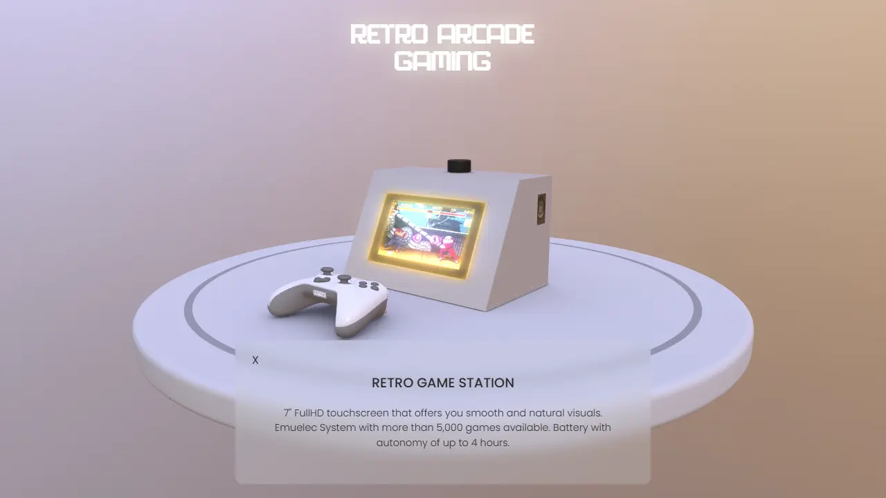

<a href="https://www.viseni.com" target="_blank"></a>

# Retro Arcade Gaming — Interactive 3D Showcase

An interactive 3D product viewer for a custom-built retro arcade cabinet, powered by **Babylon.js**. Users can explore the cabinet in 3D, click individual components to read specs, and customize the panel color — all in the browser.

---

## Demo



> Open `index.html` in a local server (e.g. `npx serve .` or Live Server in VS Code).

<a href="https://viseni.com/_demos_/retrogame/" target="_blank" style="color: #FFC53F; font-weight: bold;"><b><span>&#10003;</span>
Try the Live DEMO</b></a>

---

## Features

- **3D model viewer** — Full PBR-rendered GLB model with HDR environment lighting and real-time shadows
- **Interactive component inspection** — Click any part to highlight it and display its specs:
  - `Pantalla` — 7" FullHD touchscreen, EmuElec system, 5,000+ games, 4h battery
  - `Knob` — Dual-channel stereo audio amplifier board
  - `Xbox Controller` — Bluetooth wireless gaming controller
  - `Grid Speakers` — 5W compact stereo speakers
  - `Puerta` — Accessible door with animated open sequence
  - `Panel` — Custom MDF handcrafted panels
- **Panel color customization** — 5 color variants (Cream, Sky Blue, Red, Pink, Black); persisted via `localStorage`
- **Auto-rotating camera** — Idle auto-rotation; user can orbit, zoom, and tilt
- **Glow + Highlight layers** — Selected parts glow amber (`#FFC53F`)
- **Loading screen** — Hidden after assets fully load

---

## Tech Stack

| Layer | Technology |
|---|---|
| 3D Engine | [Babylon.js](https://www.babylonjs.com/) |
| Model format | GLB (GLTF Binary) |
| Lighting | PBR + HDR `.env` cube texture + Directional light |
| Shadows | `ShadowGenerator` (blur close exponential) |
| Lightmap | Custom baked `baseLM.png` (UV2 channel) |
| UI | HTML / CSS / Bootstrap 5 |
| Pointer events | PEP.js (cross-device pointer normalization) |
| State | `localStorage` (panel color persistence) |

---

## Project Structure

```
RetroGame/
├── index.html                  # Entry point
├── js/
│   └── main.js                 # All Babylon.js logic
├── css/
│   └── main.css                # UI styles
├── resources/
│   ├── models/
│   │   ├── RetroGame_Model_5.glb   # 3D cabinet model
│   │   └── baseLM.png              # Baked lightmap texture
│   └── env/
│       └── environment_4.env       # HDR environment (prefiltered)
└── node_modules/
    ├── babylonjs/
    ├── babylonjs-loaders/
    └── pepjs/
```

---

## Setup

### 1. Install dependencies

```bash
npm install babylonjs --save
npm install babylonjs-loaders --save
npm install pepjs --save
```

### 2. Serve locally

```bash
npx serve .
```

> Direct `file://` open will fail — browsers block local asset loading without a server.

---

## Camera Controls

| Action | Input |
|---|---|
| Orbit | Left-click drag / one-finger drag |
| Zoom | Scroll wheel / pinch |
| Auto-rotate | Activates after idle |

**Limits:** radius `0.5–3`, beta `0.75–π/2` (no upside-down), panning disabled.

---

## Color Options

| ID | Color | Hex |
|---|---|---|
| 0 | Cream (default) | `#edeadc` |
| 1 | Sky Blue | `#60c5ff` |
| 2 | Red | `#c44141` |
| 3 | Pink | `#ec8cc7` |
| 4 | Black | `#1b1b1b` |

Color selection persists across page reloads via `localStorage`.

---

## Hardware Specs (showcased in-app)

- **Screen:** 7" FullHD touchscreen
- **System:** EmuElec — 5,000+ retro games
- **Battery:** Up to 4 hours autonomy
- **Audio:** Dual-channel stereo AMP board + 5W speakers
- **Controller:** Bluetooth (Xbox-compatible)
- **Cabinet:** Custom handcrafted MDF panels

---

## License

MIT
